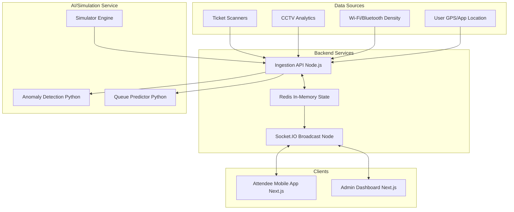

# CrowdPulse Architecture

## System Overview
CrowdPulse operates on a pseudo-microservice architecture specifically tailored for high-frequency, real-time venue telemetry. The system is designed to ingest thousands of data points per second (ticket scans, CCTV processing, Wi-Fi connections) and turn them into actionable routing decisions for attendees and monitoring alerts for admins.

## Core Components

### 1. Backend/Ingestion (Node.js + Socket.IO)
Acts as the central nervous system. It maintains the current state of queues, stadium zones, and alert states in memory (simulated).
- Emits `TICK_UPDATE` events every 3 seconds to all clients.
- Listens for `SOS_TRIGGER`, `EMERGENCY_ACTIVATE`, and `ROUTE_OVERRIDE` events.

### 2. Frontend Application (Next.js App Router)
Both Admin and Attendee apps are built logically similar but tailored for different user experiences.
- **Attendee:** Mobile-first, bottom-navigation, relies heavily on Geolocation and Route context. State management ties directly into Socket.IO for the live heatmap overlays.
- **Admin:** Desktop-first, massive data grids, alert sidebars, and control toggles.

### 3. Data Simulation & Prediction Logic
For the hackathon, real CCTV/Wi-Fi data is unavailable. The Python AI service (and Node.js simulator fallback) manipulates a generated JSON structure of the venue.
**Algorithm for Pathing:** Breadth-First Search (BFS) / A-star over a weighted graph of stadium nodes. Weights are dynamically updated based on the "density" metric from the `TICK_UPDATE`.

### Future Scope (Post-Hackathon)
- Migration from Redis to a real-time OLAP database (ClickHouse).
- Native iOS/Android via React Native.
- Real integration with Meraki Wi-Fi APIs and Genetec Security Center.
